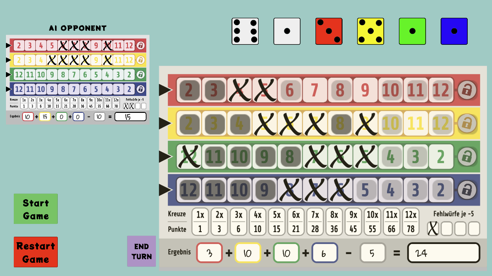

Dice Game Proto

- This is my personal project that I created to practice applying my latest skills learned at work to a new, own **Unity** project. This project also works as my code sample project, since this gives a nice overview of my code style and level currently. Project is very much work-in-progress.

- Project is done by using frameworks like **Zenject** for dependency injection (and sending Signals) and **UniRx** for reactive programming and software architecture tries to implement MVC pattern where features have their own interfaced Controllers, possibly Models and Views which are Presenter-classes and only MonoBehaviours in the project.

- Game is a simple dice game which is originally called Qwixx. I chose this game as a personal project since its rules are quite simple but interesting enough to give a nice challenge for myself to implement game logic and rules with code. Currently game can be played 1v1 against the computer. This project is not about AI programming, but the computer opponent knows how to play the game moderately. 

- Project is currently more about programming than Unity Game Development with nice UI/UX (as you can see from the image). But it is playable in Unity Editor, uses prefabs and clean folder structure. There are many features and improvements for this project on my mind but for now it acts as a code sample project to show some snippets about how my C# Unity coding looks at the moment.

- Below is the link to Scripts folder and some key classes of the project:

[Scripts Folder](Assets/Scripts)

[ScoreboardController](Assets/Scripts/Scoreboard/ScoreboardController.cs)

[ScoreboardPresenter](Assets/Scripts/Scoreboard/ScoreboardPresenter.cs)

[GameFlowController](Assets/Scripts/GameFlow/GameFlowController.cs)

Some C# / framework features used in the project:

- classes and interfaces
- fields and properties
- LINQ
- switch-expressions
- extension methods
- local functions
- reactive properties
- signals
- binding and injecting classes with dependency injection
- async/await with UniTask
